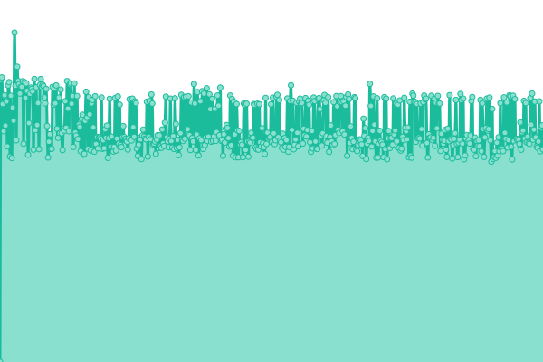
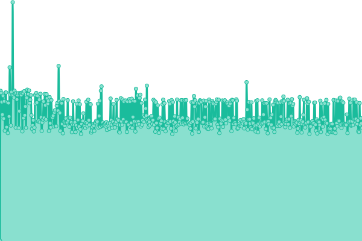
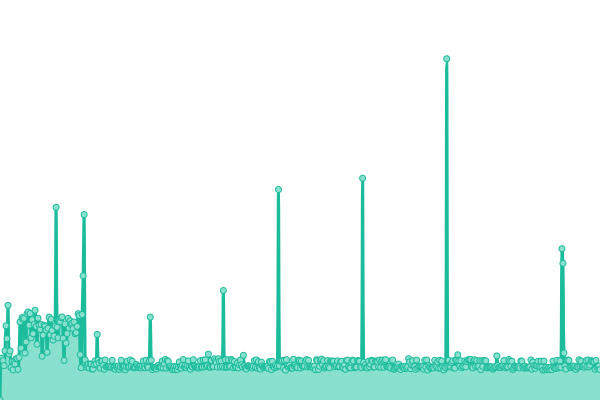
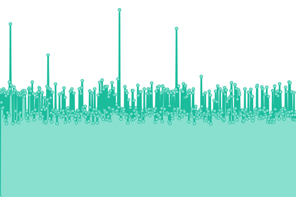

# [📈 Live Status](https://friesipayung.github.io/uptime-volantik): <!--live status--> **🟩 All systems operational**

With [Upptime](https://upptime.js.org), you can get your own unlimited and free uptime monitor and status page, powered entirely by a GitHub repository. We use [Issues](https://github.com/friesipayung/uptime-volantik/issues) as incident reports, [Actions](https://github.com/friesipayung/uptime-volantik/actions) as uptime monitors, and [Pages](https://friesipayung.github.io/uptime-volantik) for the status page.

<!--start: status pages-->
<!-- This summary is generated by Upptime (https://github.com/upptime/upptime) -->
<!-- Do not edit this manually, your changes will be overwritten -->
<!-- prettier-ignore -->
| URL | Status | History | Response Time | Uptime |
| --- | ------ | ------- | ------------- | ------ |
|  [Volantik Production Web](https://volantik.com) | 🟩 Up | [volantik-production-web.yml](https://github.com/friesipayung/uptime-volantik/commits/HEAD/history/volantik-production-web.yml) | 

 1334ms
     
 | 

<a href="https://friesipayung.github.io/uptime-volantik/history/volantik-production-web">100.00%</a>
    

|  [Volantik Staging Web](https://staging.volantik.com) | 🟩 Up | [volantik-staging-web.yml](https://github.com/friesipayung/uptime-volantik/commits/HEAD/history/volantik-staging-web.yml) | 

 1333ms
     
 | 

<a href="https://friesipayung.github.io/uptime-volantik/history/volantik-staging-web">0.00%</a>
    

|  [Volantik API](https://api.volantik.com/v1/summary) | 🟩 Up | [volantik-api.yml](https://github.com/friesipayung/uptime-volantik/commits/HEAD/history/volantik-api.yml) | 

 1573ms
     
 | 

<a href="https://friesipayung.github.io/uptime-volantik/history/volantik-api">0.00%</a>
    

|  [Volantik ICMP](volantik.com) | 🟩 Up | [volantik-icmp.yml](https://github.com/friesipayung/uptime-volantik/commits/HEAD/history/volantik-icmp.yml) | 

 284ms
     
 | 

<a href="https://friesipayung.github.io/uptime-volantik/history/volantik-icmp">100.00%</a>
    

<!--end: status pages-->

[**Visit our status website →**](https://friesipayung.github.io/uptime-volantik/)
